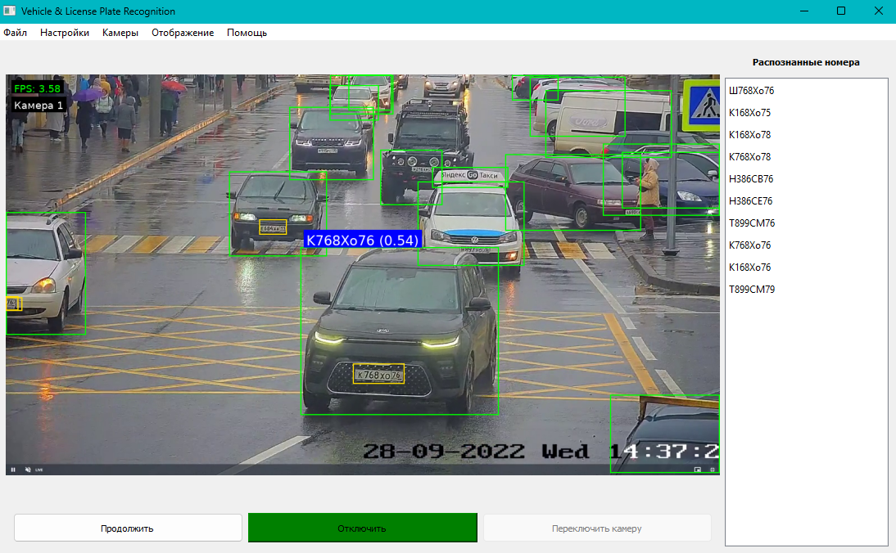

# License Plate Reader

Настольное приложение для автоматического обнаружения транспортных средств и распознавания номерных знаков в режиме реального времени.



---

## Возможности

- Поддержка **IP-камер** (MJPEG/RTSP), **USB-камер**, **видеофайлов** и **статических изображений**
- Детекция транспортных средств с помощью **YOLOv11**
- Распознавание номерных знаков обученной моделью **license_plate_detector**
- Оптическое распознавание символов через **EasyOCR** (кириллица)
- Многообъектный трекинг с помощью **SORT** (предотвращает дублирование)
- Боковая панель с последними 10 распознанными номерами
- Настраиваемый порог уверенности, ограничение FPS, шаблонная проверка номеров
- Аппаратное ускорение на GPU (CUDA), автоматический fallback на CPU

---

## Стек технологий

| Компонент | Технология |
|---|---|
| GUI | PyQt5 |
| Детекция объектов | Ultralytics YOLO (yolo11n.pt) |
| Детекция номеров | YOLO (license_plate_detector.pt) |
| OCR | EasyOCR |
| Трекинг | SORT (Kalman Filter + Hungarian Algorithm) |
| Обработка видео | OpenCV |
| Отрисовка текста | Pillow |
| Вычисления | NumPy, PyTorch |

---

## Установка

```bash
# Клонировать репозиторий
git clone https://github.com/<your-username>/local-license-plate-reader.git
cd local-license-plate-reader

# Создать виртуальное окружение
python -m venv .venv
.venv\Scripts\activate      # Windows
# source .venv/bin/activate  # Linux/macOS

# Установить зависимости
pip install -r requirements.txt
```

> **GPU:** если доступна CUDA, PyTorch автоматически использует GPU. Для установки версии с CUDA замените `torch` в requirements.txt на нужную версию с [pytorch.org](https://pytorch.org/get-started/locally/).

---

## Запуск

```bash
python main.py
```

---

## Использование

### Источники видео

| Источник | Как подключить |
|---|---|
| IP-камера | Камеры → Настроить камеры → ввести URL (MJPEG/RTSP) |
| USB-камера | Камеры → Настроить камеры → выбрать индекс |
| Видеофайл | Файл → Загрузить видео |
| Изображение | Файл → Загрузить изображение(я) |

После выбора источника нажмите **«Подключить»**.

### Настройки

- **Настройки → Порог распознавания** — минимальный уровень уверенности (по умолчанию 0.85)
- **Настройки → Шаблоны номеров** — включить/выключить проверку формата
- **Отображение → Ограничить FPS** — снизить нагрузку на CPU
- **Отображение → Показать FPS** — счётчик кадров в секунду

---

## Структура проекта

```
├── main.py                  # Точка входа, загрузка моделей
├── ui.py                    # Графический интерфейс (PyQt5)
├── util.py                  # Обработка изображений, OCR, трекинг
├── sort/
│   └── sort.py              # Алгоритм SORT
├── models/
│   ├── yolo11n.pt           # Детекция транспортных средств (COCO)
│   └── license_plate_detector.pt  # Детекция номерных знаков
├── DejaVuSans.ttf           # Шрифт для кириллицы
└── requirements.txt
```

---

## Поддерживаемые форматы номеров

Российский стандарт:
- Легковые: `А000АА197` (буква + 3 цифры + 2 буквы + регион)
- Прицепы: `АА00009` (2 буквы + 4 цифры + регион)
